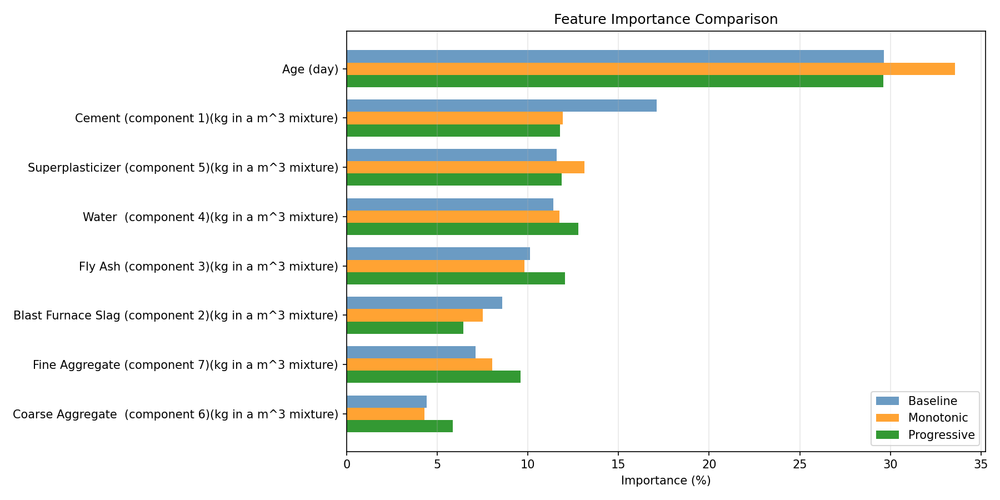
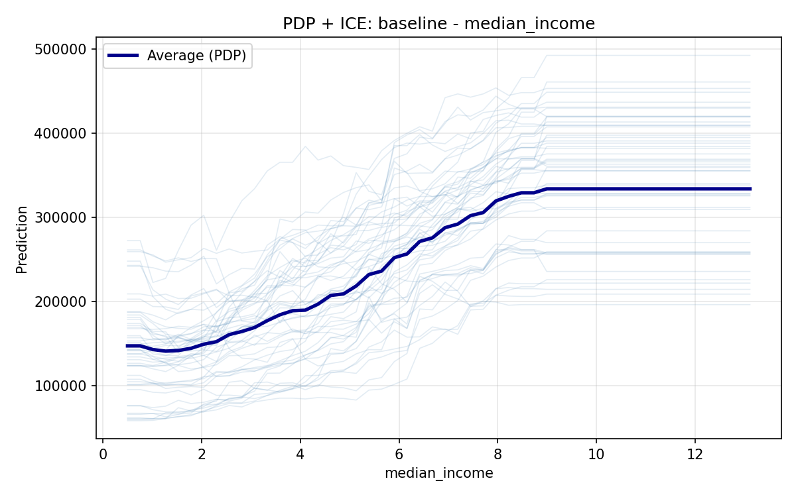
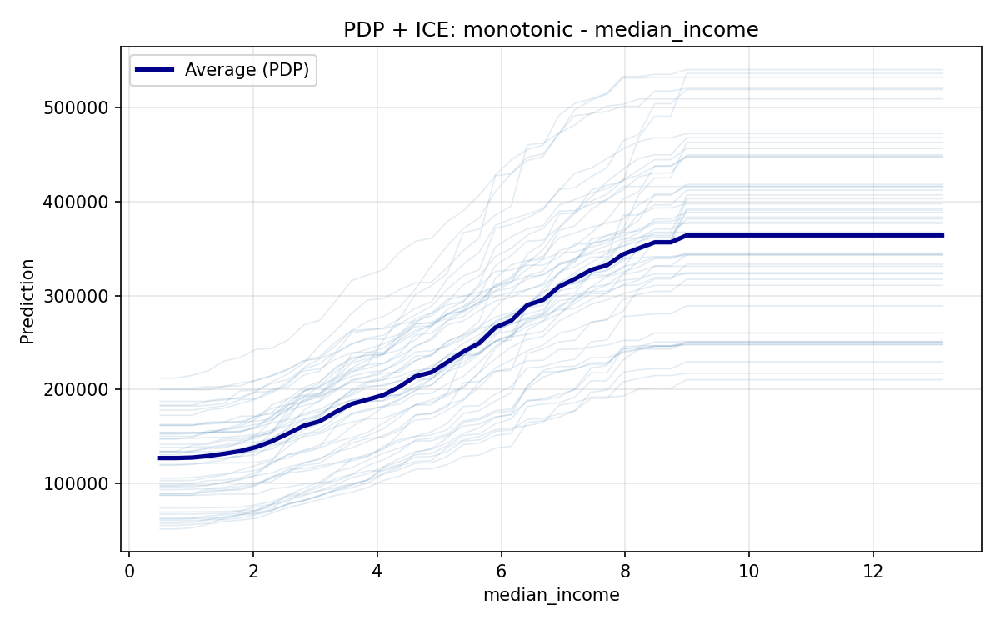
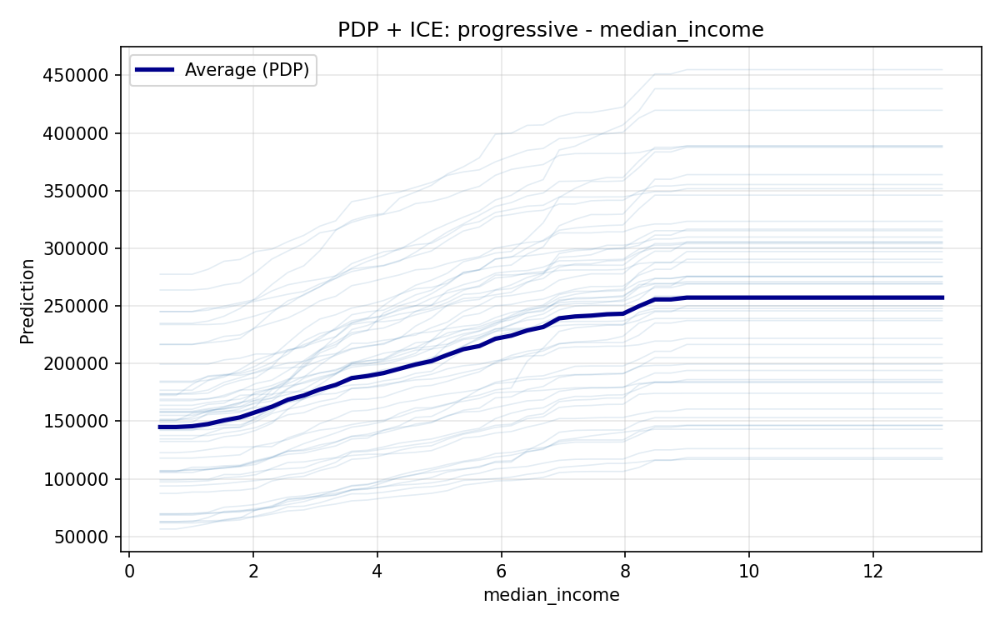

# Overcoming the Penalty of Monotonic Constraints in XGBoost: A Warm-Up Approach

## Table of Contents

- [Summary](#summary)
- [Algorithm](#algorithm)
- [Results](#results)
- [Discussion](#discussion)
  - [Concrete: Limitations with Dominant Features](#concrete-limitations-with-dominant-features)
  - [California Housing: Bias Tradeoff](#california-housing-bias-tradeoff)
- [Conclusion](#conclusion)
- [Appendix: Quick Start](#appendix-quick-start)

## Summary

Enforcing monotonicity in XGBoost frequently degrades model quality, yet monotonic constraints may be required for regulatory compliance, business logic, or improved interpretability.

**Hypothesis**: This degradation occurs because every tree in the ensemble must respect monotonicity from the first iteration. Early boosting rounds aggressively fit residuals and establish strong slopes for constrained variables—often influenced by correlations with other features. Subsequent trees cannot correct this initial over-commitment to the monotonic relationship, as they too must maintain the constraint.

**Proposed solution**: Delay the introduction of monotonic features until the model has stabilized. During an initial warm-up phase, constrained features are masked (set to constant values), forcing the ensemble to learn patterns from unconstrained features only. After this phase, constrained features are introduced via warm-starting with monotonicity enforced, building upon a more balanced foundation.

Evaluated on 5 regression datasets, this progressive approach achieves:
- **5/5** improvement over standard monotonic constraints
- In **4/5** datasets, pure monotonicity degrades performance vs. unconstrained baseline; progressive training recovers this loss in 3 of those 4 cases

## Algorithm

The core idea is to mask monotonic features (by setting them to constant values) during initial boosting rounds, then introduce them with constraints enforced. The warm-up duration is selected by treating `n_warmup` as a hyperparameter.

```
Algorithm: Warm-Up Training for Monotonic Constraints

Input:
  D         - Dataset with features F
  M ⊂ F     - Features requiring monotonic constraints
  n         - Total number of trees
  n_warmup  - Number of warm-up trees (hyperparameter)

Output:
  Trained XGBoost model with monotonic constraints on M

Procedure:
  1. D_masked ← MASK_AS_CONSTANT(D, M)
     // Set all features in M to constant values, preventing splits

  2. Model_warmup ← TRAIN_XGBOOST(D_masked, n_estimators=n_warmup, constraints=None)
     // Train initial trees on unconstrained features only

  3. Model_final ← TRAIN_XGBOOST(D, n_estimators=n-n_warmup, constraints=M,
                                 warm_start=Model_warmup)
     // Continue training with full features and monotonicity enforced

  4. Return Model_final
```

**Key hyperparameter**: `n_warmup` controls how many trees are trained before introducing monotonic features. In experiments, values of 2.5%–12.5% of total ensemble size performed well.

**Implementation**: The approach is trivial to implement and requires no modifications at inference time—the final model is a standard XGBoost model that can be used directly. During training, the masking step simply sets constrained features to their first-row value, making them constant across all samples. XGBoost cannot split on constant features, effectively excluding them from the warm-up phase. See [`src/training/progressive.py`](src/training/progressive.py) for the full implementation.

## Results

Test set MAPE (Mean Absolute Percentage Error) across 5 regression datasets. Lower is better.

| Dataset | Baseline | Monotonic | Warm-Up | n_warmup* | Δ vs Mono | Δ vs Baseline | Notes |
|---------|----------|-----------|---------|-----------|-----------|---------------|-------|
| California Housing | 15.56% | 15.97% | **15.11%** | 12.5% | -0.86% | -0.45% | See [Bias Tradeoff](#california-housing-bias-tradeoff) |
| Ames Housing | 10.53% | 10.24% | **10.06%** | 2.5% | -0.18% | -0.47% | |
| Auto MPG | 8.50% | 8.54% | **8.25%** | 7.5% | -0.29% | -0.25% | |
| Concrete Strength | **8.17%** | 8.85% | 8.65% | 2.5% | -0.21% | +0.48% | See [Limitations](#concrete-limitations-with-dominant-features) |
| Medical Insurance | 26.99% | 27.45% | **26.42%** | 2.5% | -1.03% | -0.57% | |

*\*n_warmup expressed as % of total trees from the monotonic model without warm up*

**Key observations**:
- **5/5 vs Monotonic**: Warm-up approach improves over standard monotonic constraints on all datasets
- **4/5 Monotonic penalty**: Pure monotonicity degrades performance vs. baseline in 4 out of 5 datasets
- **3/4 Recovery**: In 3 of those 4 cases, warm-up training recovers the loss and beats the baseline

## Discussion

### Concrete: Limitations with Dominant Features

The Concrete Strength dataset is the only case where warm-up training fails to recover baseline performance. However, it still improves over standard monotonic constraints (8.65% vs 8.85%), making it useful when monotonicity must be enforced.

The limitation becomes clear when examining feature importance:



The monotonic feature `Age (day)` accounts for ~30–35% of total feature importance—roughly double that of any other feature. When such a dominant predictor is masked during warm-up, the model is forced to learn from substantially less informative features, creating a suboptimal foundation that cannot be fully corrected in the second phase.

**Takeaway**: When the monotonic feature is a dominant predictor, expect smaller gains from this approach. The technique still outperforms standard monotonic constraints, but may not fully recover baseline performance.

### California Housing: Bias Tradeoff

While warm-up training achieves the best MAPE on California Housing, it introduces a notable shift in how the model attributes importance to the monotonic feature (`median_income`). The partial dependence plots reveal this tradeoff:

| Baseline | Monotonic | Warm-Up |
|----------|-----------|---------|
|  |  |  |

The monotonic model's PDP plateaus at ~$365k for high-income areas, while the warm-up model plateaus significantly lower at ~$255k. This occurs because during warm-up, the model learns to predict housing values using other features—particularly `ocean_proximity`, which increases from 59% to 71% importance while `median_income` drops from 28% to just 6%. When `median_income` is introduced in the second phase, much of its predictive signal has already been captured by location.

**Implication**: The warm-up approach may understate the true effect of the monotonic feature by attributing its signal to correlated variables learned during Phase 1. While this can improve predictive accuracy (as seen here), it changes the model's interpretation of feature relationships. This tradeoff should be considered when model interpretability is important.

## Conclusion

Monotonic constraints in XGBoost often degrade predictive performance, but this penalty can be reduced through warm-up training. By masking constrained features during initial boosting rounds, the model builds a stable foundation before monotonicity is enforced. This approach improved over standard monotonic constraints on all 5 datasets tested, and recovered baseline performance in 3 of 4 cases where pure monotonicity caused degradation. The technique is simple to implement and requires no inference-time changes.

**Limitations**: There is no guarantee that baseline performance can be fully recovered—particularly when the monotonic feature is a dominant predictor. Additionally, the warm-up phase may shift feature importance toward correlated variables, altering the model's interpretation of feature effects. These tradeoffs should be weighed against the benefits when deciding whether to apply this technique.

---

## Appendix: Quick Start

### Installation

```bash
# Install dependencies
uv sync

# Install package in editable mode
uv pip install -e .
```

### Setup Kaggle API

1. Get your Kaggle API token:
   - Go to https://www.kaggle.com/settings/account
   - Click "Create New Token" under API section
   - Copy the generated token (starts with `KGAT_`)

2. Configure credentials:
   ```bash
   cp .env.template .env
   # Edit .env and add your token: KAGGLE_API_TOKEN=your-token-here
   ```

3. Accept competition rules:
   - Visit https://www.kaggle.com/competitions/house-prices-advanced-regression-techniques
   - Click "Join Competition" and accept the rules

### Running the Pipeline

The pipeline consists of 3 numbered scripts that should be run in order:

#### Step 1: Download Datasets

```bash
uv run python scripts/01_download_data.py
```

Downloads 5 regression datasets:
- California Housing (Kaggle)
- Auto MPG (UCI)
- Medical Insurance (Kaggle)
- Concrete Strength (UCI)
- Ames Housing (Kaggle Competition)

Output: `data/*.csv`

#### Step 2: Preprocess Data

```bash
uv run python scripts/02_preprocess.py
```

Applies dataset-specific preprocessing:
- Feature engineering (ratios, ordinal encoding)
- Creates 5-fold cross-validation splits
- Designates fold 6 as test set

Output: `data_processed/*.csv` (with `fold` column)

#### Step 3: Run Experiments

```bash
uv run python scripts/03_run_experiments.py
```

Runs grid search comparing three approaches:
1. **Baseline** - Standard XGBoost (no constraints)
2. **Monotonic** - XGBoost with monotonic constraints
3. **Warm-Up** - Two-phase training (this technique)

Output:
- `results/*/grid_results.csv` - All hyperparameter combinations
- `results/*/diagnostics/*.png` - Feature importance, PDP plots
- `results/overall_summary.csv` - Best models from each dataset

## Project Structure

```
.
├── scripts/              # Entry points (run these)
│   ├── 01_download_data.py
│   ├── 02_preprocess.py
│   └── 03_run_experiments.py
├── src/                  # Library code
│   ├── preprocessing/    # Data preprocessing
│   ├── training/         # Training functions
│   ├── grid_search.py    # Experiment orchestration
│   ├── visualization.py  # Plotting and diagnostics
│   └── data_loader.py    # Data utilities
├── config/
│   └── datasets.csv      # Dataset configurations
└── docs/
    └── datasets/         # Detailed dataset descriptions
```

## Datasets

See [docs/datasets.md](docs/datasets.md) for detailed information about each dataset.

## License

MIT License - see LICENSE.md
